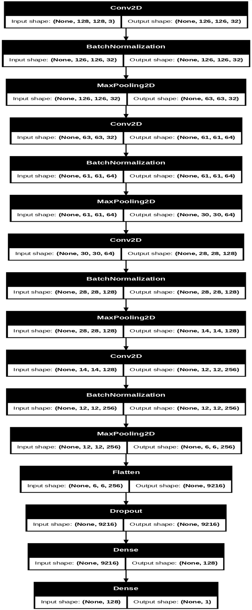
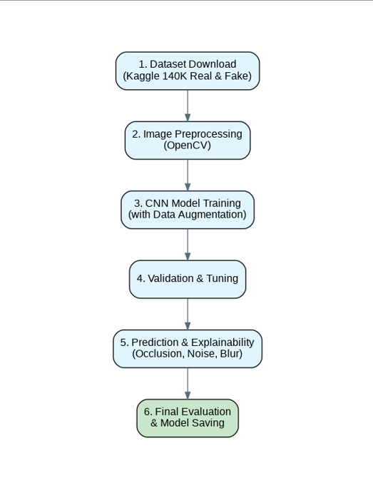
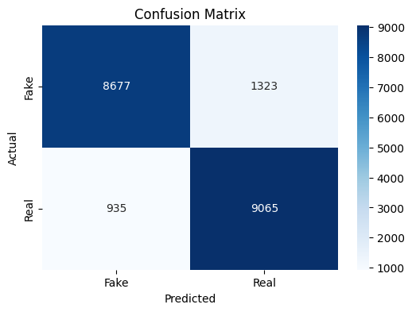
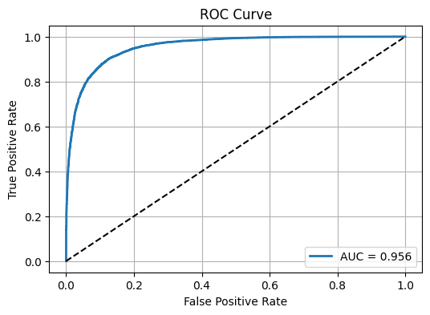
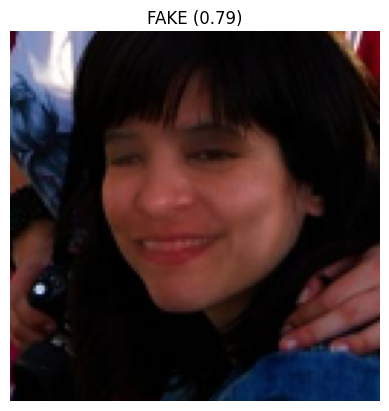

# deepfake_detection_cnn
Deepfake detection using CNN (TensorFlow &amp; OpenCV) achieving 89% accuracy with explainability analysis.

# Deepfake Detection using Convolutional Neural Networks

<div align="center">


**A robust deep learning solution for detecting AI-generated deepfake images using advanced CNN architecture**

[Features](#-key-features) • [Installation](#-installation) • [Usage](#-usage) • [Results](#-results-and-metrics) • [Documentation](#-documentation)

</div>

---

## 📋 Table of Contents

- [Overview](#-overview)
- [Author](#-author)
- [Key Features](#-key-features)
- [Problem Statement](#-problem-statement)
- [Technology Stack](#-technology-stack)
- [Dataset](#-dataset)
- [Model Architecture](#-model-architecture)
- [Methodology](#-proposed-methodology)
- [Installation](#-installation)
- [Usage](#-usage)
- [Results and Metrics](#-results-and-metrics)
- [Project Structure](#-project-structure)
- [Contributing](#-contributing)
- [Future Enhancements](#-future-enhancements)
- [References](#-references)
- [License](#-license)

---

## 🎯 Overview

Deepfake technology has rapidly evolved, making it possible to generate highly realistic synthetic human faces. While this technology has creative uses, it poses major risks in **misinformation**, **identity fraud**, and **digital manipulation**. This project addresses these challenges by implementing a robust deepfake detection system using computer vision and deep learning.

The system uses **OpenCV** for image preprocessing and **TensorFlow/Keras** for CNN-based classification. The workflow includes dataset preparation, model training with data augmentation, comprehensive evaluation using multiple metrics, and real-time prediction capabilities. The goal is to build a lightweight, accurate model that performs well on unseen images.

### Why This Matters

Current deepfake detection models face several challenges:
- Lack of accuracy on diverse datasets
- Poor generalization to new manipulation techniques
- High computational requirements
- Limited explainability

This project provides a **lightweight**, **effective**, and **interpretable** solution that achieves **89% accuracy** and **0.956 AUC score**.

---

## 👨‍💻 Author

**Vidur Gupta**  
B.Tech in Computer Science and Engineering  
Manipal University Jaipur  
Roll Number: 23FE10CSE00481

**Supervised By:** Dr. Rishi Kumar Srivastava  
School of Computer Science and Engineering

---

## ✨ Key Features

- ✅ **High Performance**: Achieves 89% classification accuracy with 95.6% AUC score
- ✅ **Robust CNN Architecture**: Custom-designed network with batch normalization and dropout
- ✅ **Real-time Detection**: Fast inference with confidence scores for each prediction
- ✅ **Interactive Web Interface**: User-friendly Gradio application for easy deployment
- ✅ **Comprehensive Explainability**: Occlusion sensitivity, noise analysis, and blur testing
- ✅ **Efficient Processing**: Optimized image preprocessing pipeline using OpenCV
- ✅ **Production-Ready**: Model saved in Keras format for seamless deployment
- ✅ **GPU Accelerated**: Training optimized for Google Colab T4 GPU

---

## 🔍 Problem Statement

Deepfakes are becoming increasingly realistic, making them extremely difficult to detect with the human eye. Research by Korshunov & Marcel (2020) demonstrates that humans struggle significantly with deepfake detection, proving the critical need for automated systems.

**Key Challenges:**
- Existing models struggle with generalization across different manipulation methods
- Limited accuracy and speed on diverse datasets
- Lack of interpretability in model decisions
- High computational requirements for deployment

**Solution:** A lightweight CNN model that can quickly and reliably classify real vs fake faces and work well on diverse images with full explainability.

---

## 🛠️ Technology Stack

### Core Frameworks
- **TensorFlow 2.x** - Deep learning framework for model development
- **Keras** - High-level neural networks API
- **OpenCV (cv2)** - Computer vision library for image preprocessing

### Scientific Computing
- **NumPy** - Numerical computing and array operations
- **Pandas** - Data manipulation and analysis
- **Matplotlib** - Data visualization and plotting
- **Seaborn** - Statistical data visualization

### Web Interface
- **Gradio** - Interactive ML model deployment

### Development Environment
- **Google Colab** - Cloud-based Jupyter notebooks with GPU support
- **Python 3.8+** - Programming language

---

## 📊 Dataset

### Dataset Information

**Source:** [140K Real and Fake Faces](https://www.kaggle.com/datasets/xhlulu/140k-real-and-fake-faces) from Kaggle

**Composition:**
- **Real Images**: 70,000 high-quality actual human faces
- **Fake Images**: 70,000 GAN-generated synthetic faces
- **Total Size**: 140,000 balanced facial images
- **Image Quality**: High-resolution, diverse demographics

**Preprocessing:**
- Balanced sampling of real and fake images
- Resizing to 128×128 pixels
- Normalization (pixel values scaled to [0,1])
- Data augmentation (rotation, flipping, zoom)

> **Note:** Dataset not included in repository due to size (>2GB) and license restrictions. Download from Kaggle link above.

---

## 🏗️ Model Architecture

Our custom CNN architecture is designed for optimal performance with computational efficiency:



### Architecture Details

```
Input Layer: (128, 128, 3) RGB Images
│
├─ Conv2D (32 filters) → BatchNormalization → MaxPooling2D
├─ Conv2D (64 filters) → BatchNormalization → MaxPooling2D
├─ Conv2D (128 filters) → BatchNormalization → MaxPooling2D
├─ Conv2D (256 filters) → BatchNormalization → MaxPooling2D
│
├─ Flatten (9216 features)
├─ Dropout (0.5)
├─ Dense (128 units, ReLU)
├─ Dense (1 unit, Sigmoid)
│
Output: Binary Classification (0 = Real, 1 = Fake)
```

### Key Components

1. **Convolutional Layers**: Extract hierarchical features from images
   - 32 → 64 → 128 → 256 filters for progressive feature learning
   
2. **Batch Normalization**: Ensures stable and faster training
   - Normalizes layer inputs for each mini-batch
   
3. **MaxPooling**: Reduces spatial dimensions while retaining important features
   - 2×2 pooling after each convolutional block
   
4. **Dropout Regularization**: Prevents overfitting
   - 50% dropout rate before final dense layer
   
5. **Dense Layers**: Final classification decision
   - 128-unit hidden layer with ReLU activation
   - Single output unit with sigmoid for probability

**Total Parameters:** ~2.5M trainable parameters

---

## 🔄 Proposed Methodology

Our systematic approach ensures robust model development and deployment:



### Workflow Steps

1. **Dataset Download** (Kaggle 140K Real & Fake Faces)
   - Download balanced dataset from Kaggle
   - Organize into training/validation/test splits

2. **Image Preprocessing** (OpenCV)
   - Resize images to 128×128 pixels
   - Normalize pixel values to [0,1] range
   - Apply data augmentation techniques

3. **CNN Model Training** (with Data Augmentation)
   - Random rotation (±20°)
   - Horizontal flipping
   - Zoom range (±20%)
   - Width/height shift (±10%)

4. **Validation & Tuning**
   - Early stopping to prevent overfitting
   - ReduceLROnPlateau for adaptive learning
   - Model checkpoint saving

5. **Prediction and Explainability**
   - Occlusion sensitivity analysis
   - Noise robustness testing
   - Blur effect evaluation

6. **Final Evaluation & Model Saving**
   - Comprehensive metrics calculation
   - Model saved in `.keras` format
   - Deployment-ready configuration

---

## 🚀 Installation

### Prerequisites

```bash
Python 3.8 or higher
pip (Python package manager)
GPU support (optional, for training)
```

### Step 1: Clone the Repository

```bash
git clone https://github.com/notvidur/deepfake_detection_cnn.git
cd deepfake_detection_cnn
```

### Step 2: Install Dependencies

```bash
pip install -r requirements.txt
```

**Requirements:**
```
tensorflow
opencv-python
numpy
matplotlib
seaborn
scikit-learn
pandas
gradio
```

### Step 3: Download Dataset

1. Visit [Kaggle Dataset](https://www.kaggle.com/datasets/xhlulu/140k-real-and-fake-faces)
2. Download and extract to `dataset/` folder
3. Organize as:
```
dataset/
├── train/
│   ├── real/
│   └── fake/
├── validation/
│   ├── real/
│   └── fake/
└── test/
    ├── real/
    └── fake/
```

---

## 💻 Usage

### Training the Model

#### Option 1: Using Jupyter Notebook

```bash
jupyter notebook deepfake_detection.ipynb
```

Execute cells sequentially:
1. Import libraries
2. Load and preprocess dataset
3. Build CNN model
4. Train with data augmentation
5. Evaluate performance
6. Save model

#### Option 2: Training in Google Colab

1. Upload notebook to Google Drive
2. Open with Google Colab
3. Enable GPU: Runtime → Change runtime type → GPU
4. Mount Google Drive for dataset access
5. Execute training cells

### Making Predictions

#### Using the Gradio Web Interface

```python
import gradio as gr
import cv2
import numpy as np
from tensorflow.keras.models import load_model

# Load trained model
model = load_model("best_deepfake_model_v2.keras", compile=False)

IMG_SIZE = 128

def predict(img):
    """Predict if image is real or fake"""
    # Preprocess image
    img = cv2.resize(img, (IMG_SIZE, IMG_SIZE))
    img = img / 255.0
    img = np.expand_dims(img, axis=0)
    
    # Get prediction
    pred = model.predict(img)[0][0]
    
    # Format output
    label = "FAKE" if pred > 0.5 else "REAL"
    confidence = pred if pred > 0.5 else 1 - pred
    
    return f"{label} — Confidence: {confidence:.2%}"

# Create Gradio interface
demo = gr.Interface(
    fn=predict,
    inputs=gr.Image(type="numpy"),
    outputs=gr.Text(label="Prediction"),
    title="🔍 Deepfake Detection System",
    description="Upload an image to detect if it's real or AI-generated",
    examples=["examples/real_1.jpg", "examples/fake_1.jpg"]
)

# Launch web app
demo.launch(share=True)
```

#### Using Python Script

```python
import cv2
import numpy as np
from tensorflow.keras.models import load_model

def detect_deepfake(image_path, model_path):
    """Detect if image is deepfake"""
    # Load model
    model = load_model(model_path, compile=False)
    
    # Load and preprocess image
    img = cv2.imread(image_path)
    img = cv2.resize(img, (128, 128))
    img = img / 255.0
    img = np.expand_dims(img, axis=0)
    
    # Predict
    prediction = model.predict(img)[0][0]
    
    # Return result
    if prediction > 0.5:
        return f"FAKE (Confidence: {prediction:.4f})"
    else:
        return f"REAL (Confidence: {1-prediction:.4f})"

# Example usage
result = detect_deepfake("test_image.jpg", "best_deepfake_model_v2.keras")
print(result)
```

---

## 📈 Results and Metrics

### Overall Performance

| Metric | Score |
|--------|-------|
| **Test Accuracy** | **89.0%** |
| **Precision** | 86.8% |
| **Recall** | 90.7% |
| **F1-Score** | 88.7% |
| **AUC-ROC** | **0.956** |

### Confusion Matrix



**Detailed Analysis:**

|  | Predicted Fake | Predicted Real |
|---|---|---|
| **Actual Fake** | 8,677 (True Positives) | 1,323 (False Negatives) |
| **Actual Real** | 935 (False Positives) | 9,065 (True Negatives) |

**Insights:**
- **True Positive Rate (Sensitivity)**: 86.8% - Successfully identified 86.8% of deepfakes
- **True Negative Rate (Specificity)**: 90.7% - Correctly classified 90.7% of real images
- **False Positive Rate**: 9.3% - Only 9.3% of real images misclassified as fake
- **False Negative Rate**: 13.2% - 13.2% of deepfakes went undetected

### ROC Curve Analysis



**Area Under Curve (AUC) = 0.956**

The ROC curve demonstrates excellent discriminatory power:
- AUC score of 0.956 indicates the model has 95.6% probability of correctly distinguishing between real and fake images
- Curve hugs the top-left corner, showing high true positive rate with low false positive rate
- Significantly outperforms random classification (diagonal line)

### Sample Predictions

#### Real Image Detection


**Prediction:** REAL (0.17)  
**Confidence:** 83%  
**Analysis:** Model correctly identifies natural facial features and authentic image characteristics

#### Fake Image Detection


**Prediction:** FAKE (0.79)  
**Confidence:** 79%  
**Analysis:** Model detects synthetic facial patterns and GAN-generated artifacts with high confidence

### Explainability Analysis

Our model includes comprehensive explainability features:

1. **Occlusion Sensitivity**
   - Tests model behavior when parts of image are obscured
   - Identifies which facial regions are most important for detection

2. **Noise Robustness**
   - Evaluates performance under various noise conditions
   - Ensures reliability in real-world scenarios

3. **Blur Effect Testing**
   - Assesses detection capability on blurred images
   - Validates model resilience to image quality variations

---

## 📁 Project Structure

```
deepfake_detection_cnn/
│
├── 📂 dataset/                      # Training and testing data (not in repo)
│   ├── train/
│   │   ├── real/                   # Real face images for training
│   │   └── fake/                   # Fake face images for training
│   ├── validation/
│   │   ├── real/                   # Real face images for validation
│   │   └── fake/                   # Fake face images for validation
│   └── test/
│       ├── real/                   # Real face images for testing
│       └── fake/                   # Fake face images for testing
│
├── 📂 diagrams/                     # Architecture and methodology visualizations
│   ├── model_architecture.png      # Detailed CNN architecture diagram
│   └── proposed_methodology.png    # Project workflow flowchart
│
├── 📂 documents/                    # Project documentation
│   ├── PBL-4_PPT_Vidur_Gupta_23FE10CSE00481.pptx
│   └── dataset.txt                 # Dataset source information
│
├── 📂 notebook/                     # Jupyter notebooks
│   └── deepfake_detection.ipynb    # Main implementation notebook
│
├── 📂 requirements/                 # Dependency specifications
│   └── requirements.txt            # Python package requirements
│
├── 📂 result/                       # Model outputs and performance metrics
│   ├── confusion_matrix.png        # Confusion matrix visualization
│   ├── roc_curve.png              # ROC curve and AUC score
│   ├── prediction_example1.png     # Sample real image prediction
│   └── prediction_example2.png     # Sample fake image prediction
│
├── 📄 deepfake_detection.ipynb      # Main Jupyter notebook
├── 📄 README.md                     # Project documentation (this file)
├── 📄 LICENSE                       # MIT License
├── 📄 .gitignore                   # Git ignore rules
└── 📄 best_deepfake_model_v2.keras  # Trained model (not in repo - too large)
```

---

## 🎯 Use Cases

### 1. Social Media Verification
- **Platform Integration**: Detect manipulated profile pictures and shared images
- **Content Moderation**: Identify and flag deepfake content automatically
- **User Protection**: Prevent identity theft and impersonation

### 2. Media Authentication
- **News Verification**: Validate authenticity of news images and media content
- **Journalism**: Fact-checking tools for reporters and editors
- **Broadcasting**: Real-time verification for live media

### 3. Security Applications
- **Identity Verification**: Detect fraudulent identity documents
- **Access Control**: Prevent unauthorized access using fake biometrics
- **Forensic Analysis**: Digital evidence authentication

### 4. Research & Education
- **Academic Research**: Computer vision and deepfake detection studies
- **AI Ethics**: Understanding implications of synthetic media
- **Student Projects**: Learning deep learning and computer vision

### 5. Enterprise Solutions
- **Corporate Security**: Protect against executive impersonation
- **Brand Protection**: Detect unauthorized use of brand imagery
- **Customer Verification**: KYC (Know Your Customer) processes

---

## 🤝 Contributing

Contributions are welcome and greatly appreciated! Here's how you can contribute:

### How to Contribute

1. **Fork the Repository**
   ```bash
   # Click the 'Fork' button on GitHub
   ```

2. **Clone Your Fork**
   ```bash
   git clone https://github.com/YOUR_USERNAME/deepfake_detection_cnn.git
   cd deepfake_detection_cnn
   ```

3. **Create a Feature Branch**
   ```bash
   git checkout -b feature/AmazingFeature
   ```

4. **Make Your Changes**
   - Add new features
   - Fix bugs
   - Improve documentation
   - Optimize code

5. **Commit Your Changes**
   ```bash
   git add .
   git commit -m 'Add some AmazingFeature'
   ```

6. **Push to Your Fork**
   ```bash
   git push origin feature/AmazingFeature
   ```

7. **Open a Pull Request**
   - Go to the original repository
   - Click 'New Pull Request'
   - Describe your changes in detail

### Contribution Guidelines

- Follow PEP 8 style guide for Python code
- Add comments and docstrings to your code
- Update documentation for new features
- Include tests for new functionality
- Ensure all tests pass before submitting PR

### Areas for Contribution

- 🐛 Bug fixes and error handling
- ✨ New features and enhancements
- 📝 Documentation improvements
- 🧪 Additional test cases
- 🎨 UI/UX improvements for Gradio interface
- 📊 Performance optimizations
- 🔬 New explainability methods

---

## 🔮 Future Enhancements

### Short-term Goals (3-6 months)

- [ ] **Video Deepfake Detection**
  - Extend model to detect deepfakes in video content
  - Frame-by-frame analysis with temporal consistency

- [ ] **Mobile Application**
  - Android/iOS app for on-the-go detection
  - Camera integration for real-time scanning

- [ ] **REST API Development**
  - FastAPI/Flask backend for easy integration
  - API documentation with Swagger/OpenAPI

### Medium-term Goals (6-12 months)

- [ ] **Multi-class Classification**
  - Identify specific types of deepfake generation methods
  - Classify GAN types (StyleGAN, ProGAN, etc.)

- [ ] **Transfer Learning Implementation**
  - Fine-tune pre-trained models (ResNet, VGG, EfficientNet)
  - Compare performance across architectures

- [ ] **Enhanced Explainability**
  - LIME (Local Interpretable Model-agnostic Explanations)
  - SHAP (SHapley Additive exPlanations)
  - Grad-CAM visualization

- [ ] **Real-time Webcam Detection**
  - Live video feed processing
  - Real-time confidence scoring

### Long-term Goals (1+ year)

- [ ] **Browser Extension**
  - Chrome/Firefox extension for web content verification
  - One-click image verification

- [ ] **Adversarial Robustness**
  - Defense against adversarial attacks
  - Improved resilience to image perturbations

- [ ] **Edge Deployment**
  - TensorFlow Lite optimization
  - Raspberry Pi and edge device deployment

- [ ] **Multi-modal Detection**
  - Audio deepfake detection
  - Text-based synthetic content detection
  - Unified multi-modal verification system

- [ ] **Federated Learning**
  - Privacy-preserving model training
  - Collaborative learning without data sharing

- [ ] **Explainable AI Dashboard**
  - Interactive visualization of model decisions
  - Feature importance analysis tools

---

## 📚 References

### Academic Papers

1. **Afchar, D., Nozick, V., Yamagishi, J., & Echizen, I. (2018)**  
   *MesoNet: A Compact Facial Video Forgery Detection Network*  
   IEEE International Workshop on Information Forensics and Security (WIFS)

2. **Du, M., Jia, R., & Song, D. (2019)**  
   *Towards Generalization of Deepfake Detection via Locality-Aware Autoencoder*  
   arXiv preprint arXiv:1910.09154

3. **Jevnisek, R., & Avidan, S. (2022)**  
   *Deepfake Detection by Aggregating Per-Layer Features*  
   Proceedings of the IEEE/CVF Conference on Computer Vision and Pattern Recognition

4. **Korshunov, P., & Marcel, S. (2020)**  
   *Deepfake Detection: Humans vs. Machines*  
   Proceedings of the European Signal Processing Conference (EUSIPCO)

5. **Verdoliva, L. (2020)**  
   *Media Forensics and DeepFakes: An Overview*  
   IEEE Journal of Selected Topics in Signal Processing

### Dataset & Tools

6. **Kaggle Dataset**  
   [140K Real and Fake Faces Dataset](https://www.kaggle.com/datasets/xhlulu/140k-real-and-fake-faces)  
   Retrieved from Kaggle, 2020

7. **Chollet, F. (2015)**  
   *Keras: The Python Deep Learning Library*  
   https://keras.io

8. **Bradski, G. (2000)**  
   *OpenCV: Open Source Computer Vision Library*  
   Dr. Dobb's Journal of Software Tools

### Additional Resources

- [TensorFlow Documentation](https://www.tensorflow.org/)
- [OpenCV Python Tutorials](https://docs.opencv.org/master/d6/d00/tutorial_py_root.html)
- [Gradio Documentation](https://gradio.app/docs/)

---

## 📝 License

This project is licensed under the **MIT License** - see the [LICENSE](LICENSE) file for complete details.

```
MIT License

Copyright (c) 2024 Vidur Gupta

Permission is hereby granted, free of charge, to any person obtaining a copy
of this software and associated documentation files (the "Software"), to deal
in the Software without restriction, including without limitation the rights
to use, copy, modify, merge, publish, distribute, sublicense, and/or sell
copies of the Software, and to permit persons to whom the Software is
furnished to do so, subject to the following conditions:

The above copyright notice and this permission notice shall be included in all
copies or substantial portions of the Software.
```

---

## 🙏 Acknowledgments

- **Dr. Rishi Kumar Srivastava** for supervision and guidance
- **Manipal University Jaipur** for providing resources and infrastructure
- **Kaggle community** for providing the 140K Real and Fake Faces dataset
- **TensorFlow and Keras teams** for excellent deep learning frameworks
- **OpenCV community** for comprehensive computer vision tools
- **Google Colab** for providing free GPU resources for model training
- **Research community** for foundational work in deepfake detection

---

## 📧 Contact

**Vidur Gupta**  
B.Tech Computer Science Engineering  
Manipal University Jaipur

- **GitHub:** [@notvidur](https://github.com/notvidur)
- **Project Link:** [https://github.com/notvidur/deepfake_detection_cnn](https://github.com/notvidur/deepfake_detection_cnn)
- **Email:** Contact via GitHub

---

## 📊 Project Statistics


---

## 🌟 Support

If you find this project helpful, please consider:

- ⭐ **Starring the repository** to show your support
- 🐛 **Reporting bugs** to help improve the project
- 💡 **Suggesting features** for future enhancements
- 📢 **Sharing** with others who might find it useful
- 🤝 **Contributing** to make it even better

---

<div align="center">

**Built with ❤️ by Vidur Gupta**

*Combating misinformation through AI-powered deepfake detection*

</div>
 f2e1701 (Update README.md)
